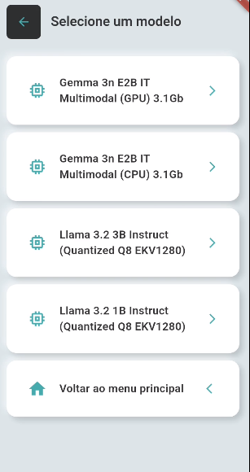

# 📱 Neural+SLM Mobile

**Neural+SLM Mobile** é uma prova de conceito que integra uma **Rede Neural** (via TensorFlow Lite) com um **Modelo de Linguagem (SLM)** dentro de um aplicativo Android construído em **Flutter**, funcionando **totalmente offline** em dispositivos **sem GPU**.

> SLM: Small Language Model

> Veja uma demo em: [Youtube Shorts](https://www.youtube.com/shorts/TwHRZeDTlks)

---
## 🖼️ Imagens
<br>
<br>
<br>
<br>

---
## 🚀 Objetivos

- Demonstrar a viabilidade de rodar **modelos de IA em smartphones comuns**.  
- Integrar um modelo de **rede neural em TFLite** com um **SLM otimizado** para execução local.  
- Garantir **funcionamento 100% offline**, sem depender de servidores externos.  
- Servir como base para futuros experimentos em **assistentes móveis inteligentes**.  

---
## 🏗️ Estrutura do Projeto

```
flutter_app/
│── assets/    
|      │── models/        
│           └── skin_cancer_model.tflite
│── configs/             
│── lib/       
│   ├── core/            
│   ├── features/        
│   ├── services/        
│   │    └── tflite/
│   ├── main.dart        
```

---
## 🛠️ Tecnologias Utilizadas

- **Flutter** (Dart)  
- **TensorFlow Lite** para execução da rede neural no celular  
- **SLM otimizado** (flutter_gemma)  
- **Arquitetura modular** em Flutter (core, features, services)  

---
## 📱 Como Executar

1. Clone este repositório:
   ```bash
   git clone https://github.com/joaopedroangelo/Neural_SLM_Mobile.git
   ```
2. Acesse a pasta do projeto:
   ```bash
   cd <path para o projeto>
   ```
3. Instale as dependências do Flutter:
   ```bash
   flutter pub get
   ```
4. Rode no emulador ou dispositivo real:
   ```bash
   flutter run
   ```
---
## ⚡ Desafios

- Quantização e otimização para rodar em CPU.  
- Gerenciamento de memória em dispositivos móveis.  
- Garantir **tempo de resposta aceitável** sem GPU.  
- Manter execução totalmente **offline**.
- O **pubspec.lock** foi commitado para "lockar" as versões das dependências, evitando problemas com atualizações.

---
## 📜 Licença

Distribuído sob a licença GPL-3.0  

Em casos de forks ou alterações, dê os devidos créditos ao projeto inicial.

Este projeto é apenas uma **prova de conceito experimental**.
